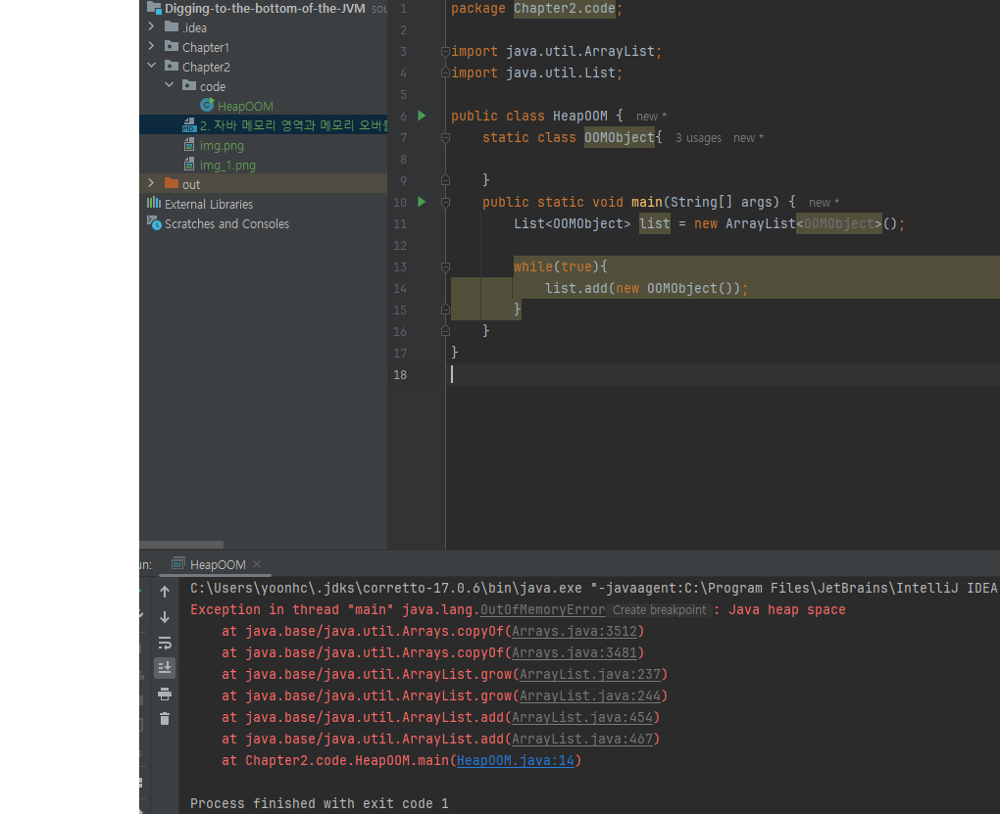
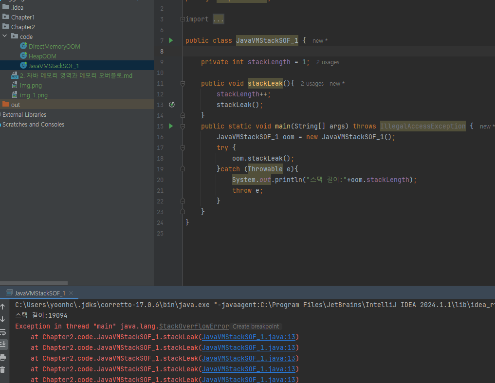
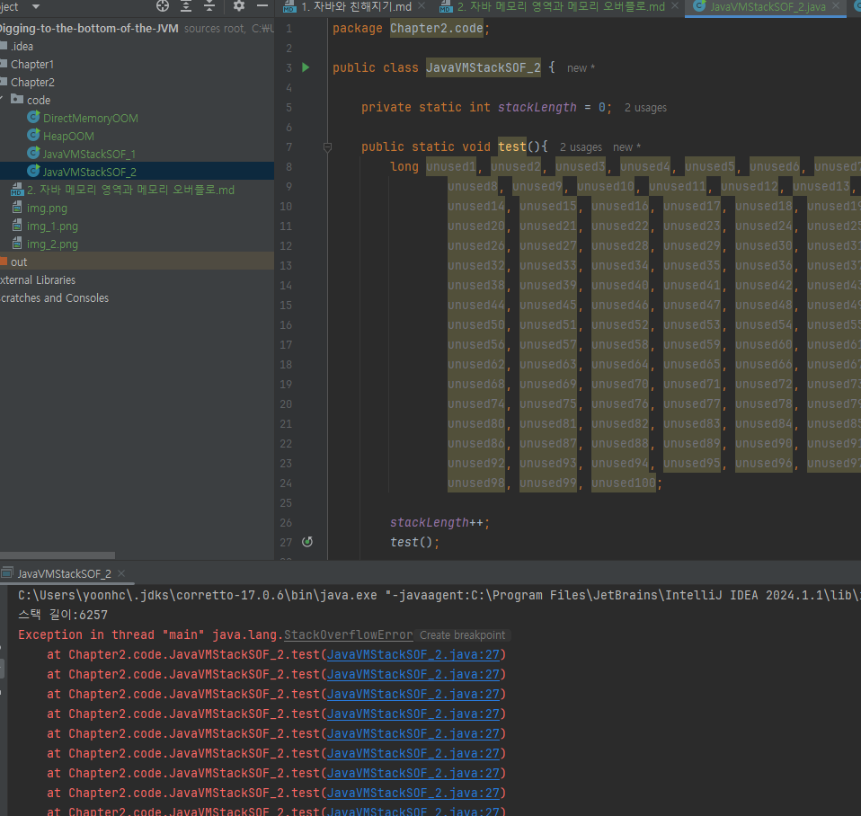
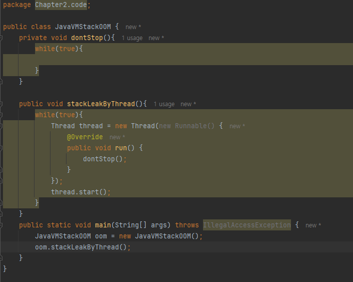
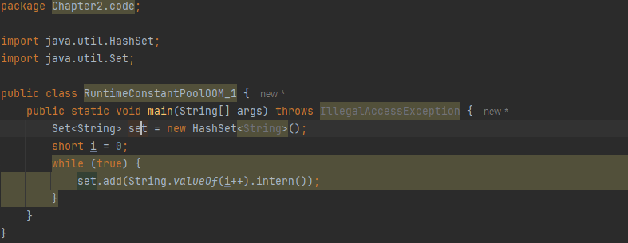
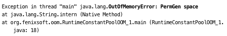
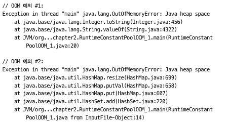
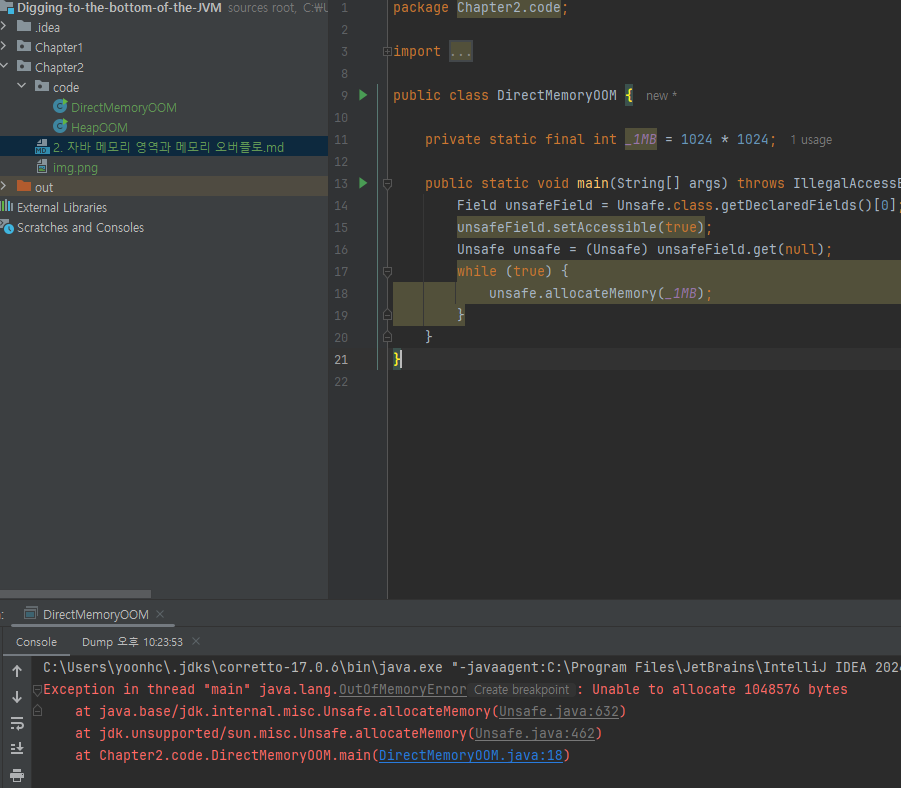

# 2. 자바 메모리 영역과 메모리 오버플로
## 2.1 들어가며
## 2.2 런타임 데이터 영역
### 2.2.1 프로그램 카운터
### 2.2.2 자바 가상 머신 스택
### 2.2.3 네이티브 메서드 스택
### 2.2.4 자바 힙
### 2.2.5 메서드 영역
### 2.2.6 런타임 상수 풀
### 2.2.7 다이렉트 메모리
## 2.3 핫스팟 가상 머신
### 2.3.1 객체 생성
### 2.3.2 객체의 메모리 레이아웃
### 2.3.3 객체에 접근하기
## 2.4 실전: OutOfMemoryError 예외
- 해당 절은 두가지 실용적인 목적
  - 각 런타임 영역에 저장되는 내용을 검증
  - 실제 메모리 오버플로가 일어나는 과정을 검증
### 2.4.1 자바 힙 오버플로
- 객체 인스턴스를 저장하는 공간
- 객체를 계속 생성하고, 접근할 경로가 살아 있으면 언젠가는 힙의 최대 용량을 넘어설 것 -> 메모리 오버플로
  - -Xms: 최소크기 설정
  - -Xmx: 최대 크기 설정
  - -XX:+HeapDumpOnOutOfMemoryError: 예외 발생 시점에서 힙 메모리 스냅숏을 파일로 저장(dump)

 
- 자바 애플리케이션에서 OOM이 제일 많이 발생하는 영역이며, 'java.lang.OutOfMemoryError: Java heap space' 로 출력됨
- 문제를 해결하는 일반적인 방법은 메모리 이미지 분석 도구로 힙 덤프 스냅숏을 분석해보는 것
  - 오버플루를 일으킨 객체가 메모리 누수인지, 오버플루인지 확인 필요 -> 필요 없는 객체가 원인이라면 메모리 누수임
  - 메모리 누수라면? 
    - 도구를 이용해 누수된 객체로부터 GC루트까지의 참조 사실을 확인 -> 누수 부분 확인 및 수정
  - 메모리 누수가 아니면?
    - -Xms와 -Xmx을 통해 컴퓨터 가용 메모리를 비교하여 더 많이 할당
    - 코드에서 수명 주기가 너무 길거나 상태를 너무 오래 유지하는 객체 없는지 확인

### 2.4.2 가상 머신 스택과 네이티브 스택 오버플로
- 핫스팟 가상 머신은 가상 머신 스택과 네이티브 메서드 스택을 구분하지 않음
  - 네이티브 메서드 스택의 크기를 설정하는 -Xoss 매개 변수를 설정하더라도 아무런 효과가 없음
  - 스택크기는 오직 -Xss 매개변수로만 변경 가능
- <<자바 가상 머신 명세>>에 따르면 가상 머신 스택과 네이티브 메서드 스택에서는 다음 경우에 예외 발생
  - 스레드가 요구하는 스택 깊이가 가상 머신이 허용하는 최대 깊이보다 크면 StackOverflowError를 던짐
  - 가상 머신이 스택 메모리를 동적으로 확장하는 기능을 지원하나, 가용 메모리가 부족해 스택을 더 확장할 수 없다면 OOM을 던짐
- 핫스팟은 확장을 지원하지 않음 -> 스택 용량 부족하여 새로운 스택 프레임을 담을 수 없을때만 StackOverflowError를 발생
- 다음 2가지 상황 테스트
  - -Xss 매개 변수로 스택 용량 줄이고, StackOverflowError 발생 
     
  - 지역 변수를 많이 선언해서 메서드 프레임의 지연 변수 테이블 크기를 키움 -> StackOverflowError 발생 
     
- OOM 발생 코드 
   
- 너무 많은 스레드를 만들어 메모리 오버플로가 일어나는 경우라면, 프로그램에서 사용하는 스레드 수를 줄일 수 없고 64비트 가상 머신도 사용할 수 없는 상황이라면?
  - 최대 힙 크기와 스택 용량을 줄이는 것
### 2.4.3 메서드 영역과 런타임 상수 풀 오버플로
- 런타임 상수 풀은 메서드 영역에 속하므로 오버 플로 테스트를 함께 수행 가능
- JDK7부터 영구 세대를 점진적으로 없애고 JDK8에 와서 메타스페이스로 완전히 대체
- 영구세대 또는 메타스페이스에 에러가 발생하는지 확인하는 코드 
   
  - JDK6이면 아래와 같이 에러남(영구세대) -> 런타임 상수 풀이 메서드 영역(영구세대)이라는 것 확인 
     
  - JDK7이면 아래처럼 에러남 -> 문자열 상수 풀이 힙 메모리로 옮겨 졌다는거 확인 가능 
     

### 2.4.4 네이티브 다이렉트 메모리 오버플로
- -XX:MaxDirectMemorySize 로 설정, 따로 설정하지 않으면 -Xms로 설정한 자바 힙의 최댓값과 같음
- 아래 코드는 DirectByteBuffer 클래스를 건너뛰고 리플렉션을 이용해 Unsafe 인스턴스를 직접 얻어 메모리 할당 
 
- 다이렉트 메모리에서 발생한 메모리 오버플로는 힙 덤프 파일에서는 이상한 점을 찾을 수 없음
  - 덤프 파일이 매우 작고 DirectMemory를 직접 또는 간접으로 사용했다면, 다이렉트 메모리에서 원인을 찾는데 집중 필요