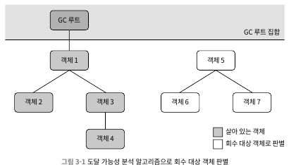
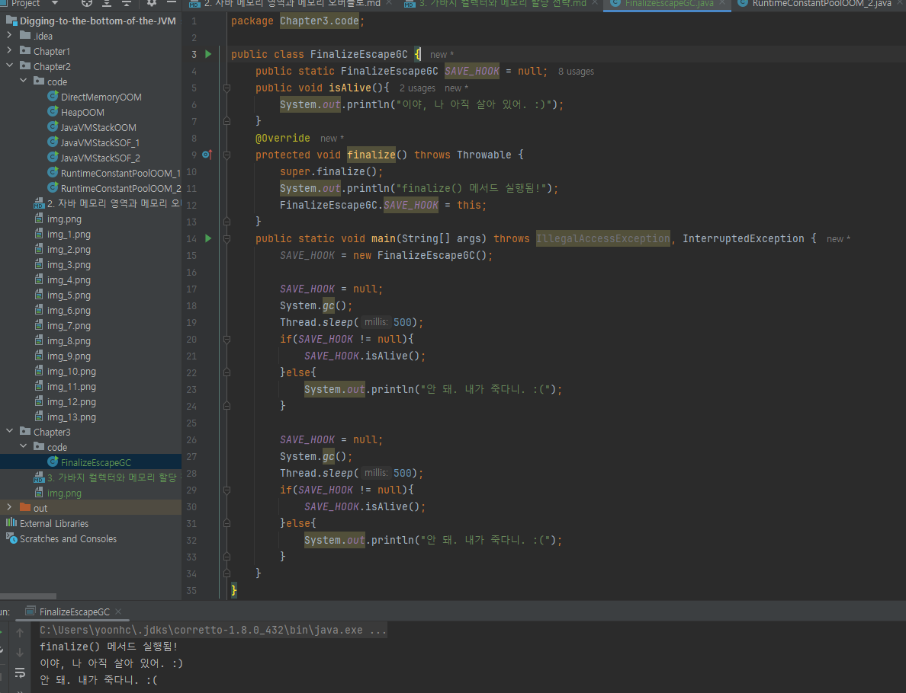
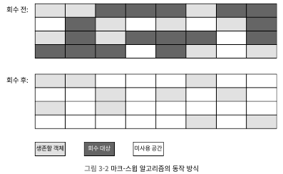
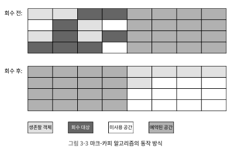
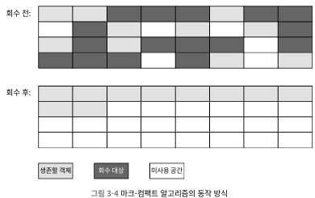

# 3. 가바지 컬렉터와 메모리 할당 전략
## 3.1 들어가며
- 오늘날 동적 메모리 할당과 가바지 컬력션 기술은 상당히 성숙됨 -> 모든 것이 자동화
- 그럼 위에 내용을 이해를 해야 하는 이유는? 
  - 다양한 메모리 오버플루와 누수 문제를 해결해야 하는 상황이나, 더 높은 동시성을 달성하는데 가비지 컬렉션이 방해가 되는 상황을 조율하기 위해
- 자바 힙과 메서드 영역이 '메모리 할당과 회수'에 속함
## 3.2 대상은 죽었는가?
- 청소를 하려면 자바 힙에 어떤 객체가 살았고 죽었는지 판단해야함
### 3.2.1 참조 카운팅 알고리즘
- 많은 교제에서 객체가 살아 있음을 판별하는 알고리즘
  - ① 객체를 가리키는 참조 카운터 추가, 참조가 늘어날 수록 1씩 증가
  - ② 참조하는 곳이 하나 사라질 때마다 카운터 값을 1씩 감소
  - ③ 카운터 값이 0이 된 객체는 더는 사용 불가능
- 자바 가상머신에서는 참조 카운팅을 사용하지 않음
  - 고려해야할 특이 상황이 적지 않고, 모든 상황에 대해 계산해야 할 게 많음
- 참조 카운팅은 순환 참조 문제를 가짐
  - 서로 참조하면 참조 숫자가 0이 되지 않음
### 3.2.2 도달 가능 분석 알고리즘
- 오늘날 주류 프로그래밍 언어들은 도달 가능 분석 알고리즘을 이용 
   
  - GC 루트라고 하는 루트 객체를 시작 노드 집합으로 사용
  - 어떤 객체가 GC 루트 사이를 이어 주는 참조 체인이 없으면 회수 대상이 됨
- 자바에서 GC루트로 이용할 수 있는 객체
  - 가상 머신 스택에서 참조하는 객체
  - 메서드 영역에서 클래스가 정적 필드로 참조하는 객체
  - 메서드 영역에서 상수로 참조되는 객체
  - 네이티브 메서드 스택에서 JNI가 참조하는 객체
  - 자바 가상 머신 내부에서 쓰이는 참조: 기본 데이터 타입에 해당 하는 Class 객체, 일부 상주 예외, 시스템 클래스 로더
  - 동기화 락(synchronized 키워드)으로 잠겨 있는 모든 객체
  - 자바 가상 머신 내부 상황을 반영하는 JMXBean
- 최신 가바지 컬렉터들은 예외 없이 부분 컬렉션을 지원 및 GC 루트가 너무 많아 지지 않도록 다양한 최적화 적용
### 3.2.3 다시 참조 이야기로
- 객체의 생사 판단과 '참조'는 떼어서 생각할 수 없음
  - 참조 카운팅 알고리즘이나 GC 루트나 모두 활용
- JDK 1.2부터 참조 개념을 4가지로 구분
  - 강한 참조(strong)
    - 가장 전통적인 정의의 참조
    - Object obj = new Object()처럼 프로그램 코드에서 참조 할당
    - 강한 참조 관계가 남아 있는 객체는 절대 회수되지 않음
  - 부드러운 참조(soft)
    - 유용하지만 필수는 아닌 객체
    - 부드러운 참조만 남은 객체면 메모리가 오버플루가 나기 직전 두 번째 회수를 위한 회수 목록에 추가
    - 두번 째 회수 후에도 메모리가 부족하면 메모리 오버플루 발생
  - 약한 참조(weak)
    - 부드러운 참조와 비슷하지만 연결 강도가 더 약함
    - 약한 참조뿐인 객체는 다음번 가비지 컬렉션까지만 살아 있음
    - 메모리가 넉넉하더라도 약하게 참조된 객체는 모두 회수
  - 유령 참조(phantom)
    - 참조 중에 가장 약함
    - 객체 수명에 아무런 영향을 주지 않으며, 참조를 통해 객체 인스턴스를 가져오는 것마저 불가능
    - 대상 객체가 회수될 때 알림을 받기 위한 목적만 존재
### 3.2.4 살았나 죽었나?
- 도달 가능성 분석 알고리즘이 '도달 불가능' 객체라고 판단해도 반드시 죽어야하는 건 아님
  - '유예' 단계 존재하며, 확실한 사망 선고를 내리려면 두 번의 표시 과정 필요
  - GC 루트와 연결된 참조 체인을 찾지 못한 객체에는 `첫번 째 표시`가 이루어지며 필터링(finalize 진행 여부)이 진행됨
  - finalize를 실행해야 하는 객체로 판명되면 F-큐라는 대기열에 추가됨
    - 가상 머신에서 우선 순위가 낮은 종료자 스레드를 생성해 F-큐에 들어 있는 개체들의 finalize 메서드를 실행
      - 참고로 가상 머신은 이 메서드를 시작만 시킬 뿐 끝날 때까지 기다려주지 않음
  - finalize 메서드는 죽음을 직면한 객체가 부활할 수 있는 마지막 기회 -> 참조 체인의 아무 객체나 다시 연결
  - 이때 빠져 나오지 못하면 진짜로 회수 
   
    - 어떤 객체든 finalize 함수는 한번만 실행됨 -> 주간 2번째 GC때 finalize 실행 안됨
    - 독자들은 위와 같은 예시로 객체를 구원하면 안됨 -> 가능한 사용하지 말기
    - 리소스 정리에 유용하다고 소개하는 책도 있지만, finalize보단 try-finally 등의 다른 방법 활용하지
### 3.2.5 메서드 영역 회수하기
- <<자바 가상 머신 명세>>에 따르면 가비지 컬렉터가 메서드 영역을 반드시 청소해야 하는 건 아님
  - JDK 11에 처음 탑재된 ZGC 컬렉터는 클래스 언로딩을 미지원
- 대체로 메서드 영역 가비지 컬렉터는 대체로 `비용 효율`이 좋지 않음 -> 회수 조건이 까다로움
- 메서드 영역의 가비지 컬렉션은 크게 두 가지를 회수함 -> 더 이상 사용하지 않는 `상수`와 `클래스`
  - 다 쓴 '상수'를 회수하는 방법은 자바 힙 객체 회수와 유사
    - 상 수 풀 안의 상수를 참조하는 객체가 전혀 없고, 가상 머신에서 사용하는 코드도 없으면 회수
    - 상수 풀에 있는 다른 클래스, 메서드 등도 비슷한 방법으로 회수
  - 클래스는 상수보다 회수 조건이 더 까다로움
    - 다음 세 가지 조건 만족해야함
      - 클래스 인스턴스가 모두 회수 되었는가 -> 자바 힙에 미 존재
      - 이 크래스를 읽어 들인 클래스 로더가 회수 되었는가
      - 이 클래스에 해당하는 java.lang.class 객체를 아무 곳에서도 참조하지 않고 리플렉션 기능으로 메서드 이용하는 곳도 전혀 없는가
    - 세 가지 조건을 만족해도 회수를 `허용`하지 반드시 회수는 아님
- 리플렉션, 동적 프락시 등 바이트 코드 프레임 워크를 많이 사용 하는 경우나, J클래스 로더를 자주 사용하는 환경에서 타입 언로딩을 지원해야함
  - 메서드 영역 과도한 압박에 시달리는 일을 막을 수 있음
## 3.3 가바지 컬렉션 알고리즘
- 수많은 기법과 가상 머신 또는 플랫폼에 따라 차이를 지님
- 객체 생사 판별 방식 기준으로 알고리즘은 `참조 카운팅 GC`와 `추적 GC`로 나눌 수 있음
  - `직접 가바지 컬렉션`과 `간접 가비지 컬렉션`이라 부르기도 함
  - `참조 카운티 GC`는 이 책에서 다루는 주류 가상 머신에서 사용하지 않음 -> 추적 GC만 다룸
### 3.3.1 세대 단위 컬렉션 이론
- 대부분 채택한 방법이며, 대다수 프로그램에서 관측된 실제 상황들에서 얻은 경험 법칙을 구현한 것
- 두가지 가정이 뿌리를 내림
  - 약한 세대 가설: 대다수 객체는 일찍 죽는다
  - 강산 세대 가설: 가비지 컬렉션 과정에서 살아남은 횟수가 늘어날수록 더 오래 살 가능성이 커짐
- 위의 가정으로 자바 힙을 몇 개의 영역으로 나누고 객체들을 나이에 따라 다른 영역에 할당
  - 영역 안의 객체 대부분이 곧바로 죽을 운명이라면, 한데 몰아 넣고 회수 -> 적은 비용으로 대량의 메모리 확복 가능
- 가바지 컬렉터는 한 번에 하나 또는 몇개 영역만 선택해 회수 -> 마이너 GC, 메이저 GC, 전체 GC
- 각 영역에 담긴 객체들의 생존 특성에 따라 마크-스윕(표시 후 쓸기), 마크-카피(표시 후 복사), 마크-컴팩트(표시 후 모으기) 등 구분해 적용
- 세대 단위 컬렉션 이론은 자바 힙을 최소 두 개의 영역으로 나눔(신세대, 구세대)
  - 신세대는 다수의 객체가 죽고 소수만 구세대로 승격
### 3.3.2 마크-스윕 알고리즘
 
- 먼저 회수할 객체들에 모두 표시한 다음, 표시된 객체들을 쓸어 담는 식
  - 살릴 객체들에 표시한 다음, 표시되지 않은 객체를 회수하기도 함
- 다른 알고리즘들이 이 알고리즘을 기초로 하여, 단점을 보완하는 식으로 발전함
- 해당 알고리즘의 큰 단점 두가지
  - 실행 효율이 일정하지 않음
    - 힙 내 다량의 객체 대부분이 표시되고 회수되면 작업이 많아짐 -> 효율이 떨어짐
  - 메모리 파편화가 심함
    - GC 후 불연속적으로 메모리 파편이 만들어짐 -> 맞는 메모리 찾기가 어려워 또 다른 GC 유발
### 3.3.3 마크-카피 알고리즘
 
- 회수 객체가 많아질수록 효율이 떨어지는 마크-스윕 알고리즘을 보완한 알고리즘
- 가용 메모리를 똑같은 크기의 두 블록으로 나눠 활용
  - 한쪽 블록이 꽉차면 다른 블록에 복사하고 기존 블록은 청소
  - 메모리 파편화 방지를 하며, 구현이 쉽고 실행 효율도 좋음
  - 가용 메모리를 절반으로 줄여 낭비가 심함
- 오늘날 사용 가상 머신에서 대부분 해당 알고리즘 활용
  - 신세대 객체중 98%가 첫번 째 GC에서 죽기 때문에 메모리 영역을 1:1로 나누지 않아도 됨
  - 아펠 스타일 컬렉션으로 더욱 진화
    - 신세대를 하나의 큰 공간과 작은 두 개의 공간으로 나눔 -> 에덴 공간 및 작은 공간에서 살아남은 객체들은 또 다른 작은 공간으로 이전
    - 에덴과 생존자 공간 비율은 기본적으로 8:1 -> 전체 메모리 90% 사용, 낭비 공간 10%
    - 살아남는 케이스가 10% 이상이면? 생존자 공간이 모자르면 구세대에게 메모리 할당(핸들 승격), 구세대로 승격하는 것
### 3.3.4 마크-컴팩트 알고리즘
 
- 마크-카피 알고리즘은 객체 생존율이 높을수록 복사할 게 많아져 효율이 나빠짐
- 
## 3.4 핫스팟 알고리즘
### 3.4.1 루트 노드 열거
### 3.4.2 안전 지점
### 3.4.3 안전 지역